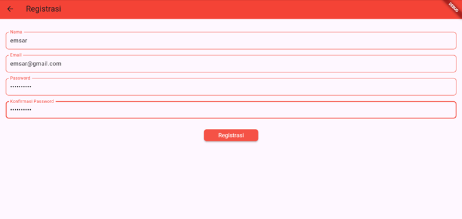
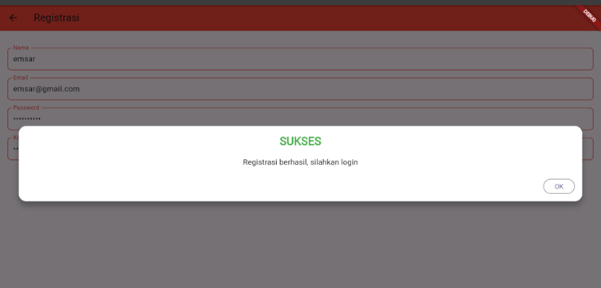
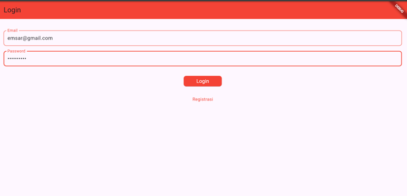
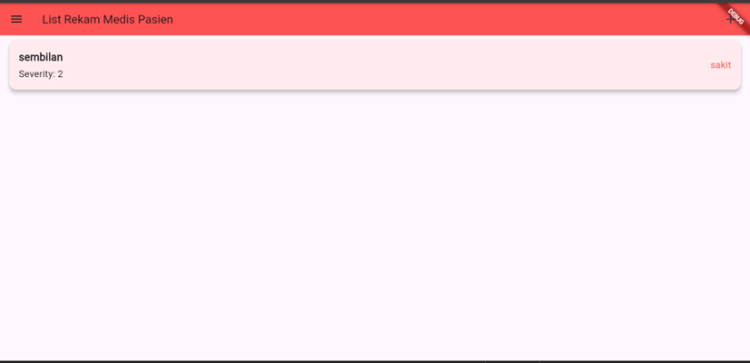
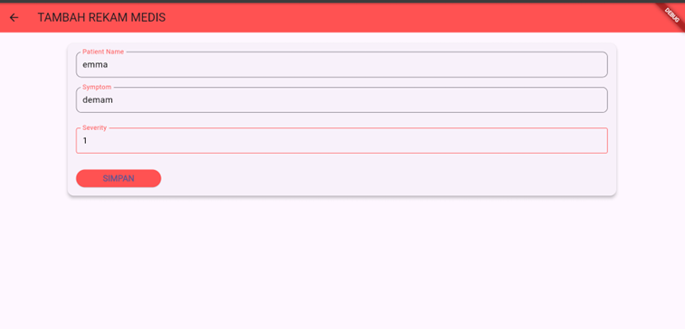
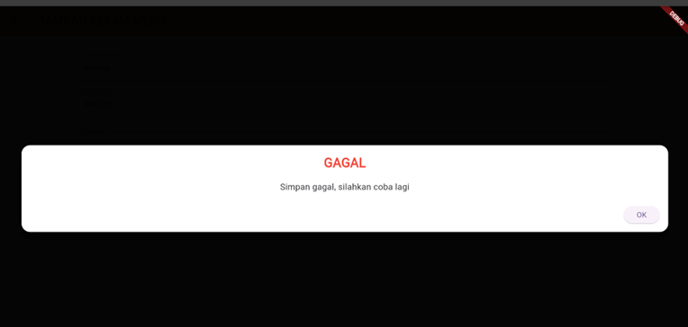
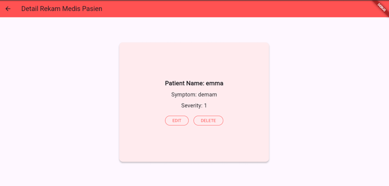
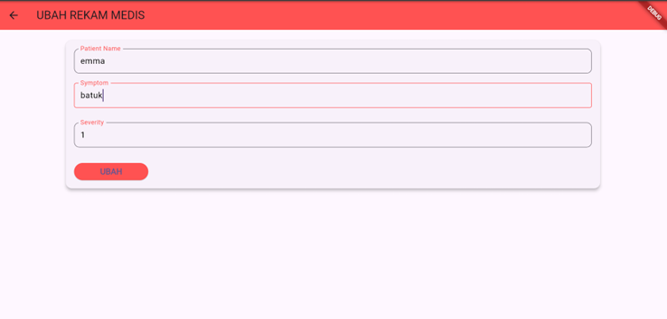
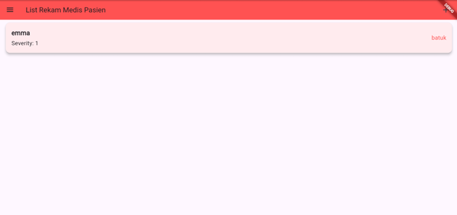
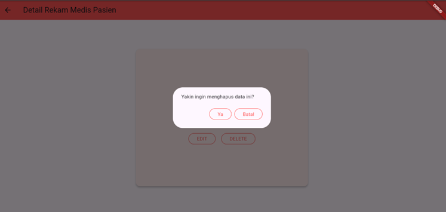

# aplikasi_manajemen_kesehatan

A new Flutter project.

## Getting Started

This project is a starting point for a Flutter application.

A few resources to get you started if this is your first Flutter project:

- [Lab: Write your first Flutter app](https://docs.flutter.dev/get-started/codelab)
- [Cookbook: Useful Flutter samples](https://docs.flutter.dev/cookbook)

For help getting started with Flutter development, view the
[online documentation](https://docs.flutter.dev/), which offers tutorials,
samples, guidance on mobile development, and a full API reference.
1. lampiran register

2. lampiran register sukses

3. lampiran login

4. lampiran login sukses

5. lampiran form tambah

6. lampiran form tambah gagal

7. lampiran tambah sukses

8. lampiran detail

9. lampiran form ubah

10. lampiran form ubah sukses

11. lampiran alert delete

12. lampiran delete sukses
